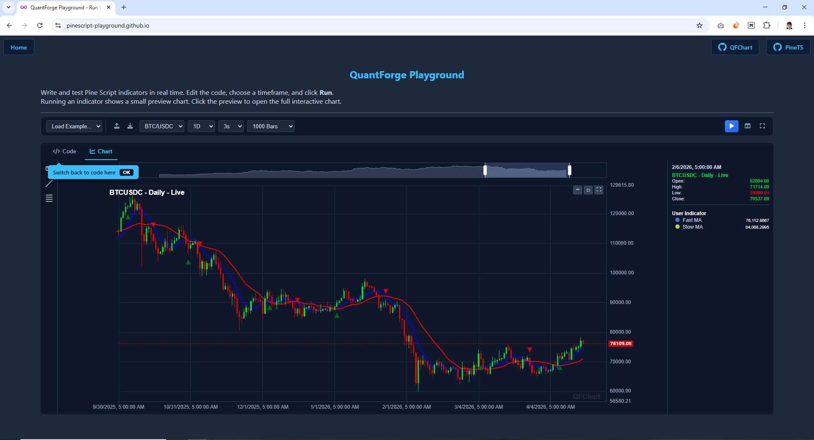

# QFChart

> A powerful, high-performance financial charting library built on Apache ECharts

QFChart is a lightweight, feature-rich financial charting library designed for building professional trading platforms. It combines the power of Apache ECharts with an intuitive API specifically tailored for OHLCV candlestick charts, technical indicators, and interactive drawing tools.



## ✨ Features

### Core Charting

-   **📊 Candlestick Charts** - High-performance rendering of OHLCV data with customizable colors
-   **⚡ Real-time Updates** - Incremental data updates for live trading without full re-renders
-   **🎯 Multi-Pane Indicators** - Stack indicators in separate panes (RSI, MACD, etc.) with customizable heights
-   **📈 Overlay Indicators** - Add indicators directly on top of the main chart (SMA, Bollinger Bands, etc.)
-   **🔍 Interactive Zoom** - Smooth zooming and panning with customizable data range controls

### Drawing Tools (Plugins)

A plugin system is used to allow adding custom drawing tools to the charts.
Currently available plugins :

-   **✏️ Line Drawing** - Draw trend lines and support/resistance levels
-   **📏 Fibonacci Retracements** - Interactive Fibonacci levels with automatic ratio calculations
-   **📐 Measure Tool** - Measure price and time distances between any two points

### Layout & Customization

-   **🎨 Flexible Layouts** - Configurable sidebars for data display (Left/Right/Floating)
-   **📱 Responsive Design** - Automatically handles window resizing and layout adjustments
-   **🌙 Dark Mode Ready** - Built-in dark theme with customizable colors
-   **⚙️ Plugin System** - Extensible architecture for adding custom tools and features

### Developer Experience

-   **🔷 TypeScript Support** - Written in TypeScript with full type definitions
-   **📚 Comprehensive Docs** - Detailed API documentation and examples
-   **🎯 Event System** - Rich event API for chart interactions and state management
-   **🔧 Modular Architecture** - Clean, maintainable codebase with clear separation of concerns

## 📦 Installation

### Browser (UMD)

```html
<!-- 1. Include ECharts (Required) -->
<script src="https://cdn.jsdelivr.net/npm/echarts/dist/echarts.min.js"></script>

<!-- 2. Include QFChart -->
<script src="https://cdn.jsdelivr.net/npm/@qfo/qfchart/dist/qfchart.min.browser.js"></script>
```

### NPM

```bash
npm install @qfo/qfchart echarts
```

### Yarn

```bash
yarn add @qfo/qfchart echarts
```

## 🚀 Quick Start

### 1. Create a Container

```html
<div id="chart-container" style="width: 100%; height: 600px;"></div>
```

### 2. Initialize the Chart

```javascript
import { QFChart } from '@qfo/qfchart';

// Initialize
const container = document.getElementById('chart-container');
const chart = new QFChart(container, {
    title: 'BTC/USDT',
    height: '600px',
    databox: {
        position: 'right', // or 'left', 'floating'
    },
});

// Set market data
const marketData = [
    {
        time: 1620000000000,
        open: 50000,
        high: 51000,
        low: 49000,
        close: 50500,
        volume: 100000,
    },
    // ... more data
];

chart.setMarketData(marketData);
```

### 3. Add Indicators

```javascript
// Add overlay indicator (e.g., SMA)
const smaPlots = {
    sma: {
        data: [
            { time: 1620000000000, value: 50200 },
            // ...
        ],
        options: {
            style: 'line',
            color: '#2962FF',
            linewidth: 2,
        },
    },
};

chart.addIndicator('SMA_20', smaPlots, {
    isOverlay: true,
});

// Add separate pane indicator (e.g., MACD)
const macdPlots = {
    histogram: {
        data: [
            { time: 1748217600000, value: 513.1184116809054, options: { color: '#26A69A' } },
            /* ... */
        ],
        options: { style: 'histogram', color: '#26A69A' },
    },
    macd: {
        data: [
            /* ... */
        ],
        options: { style: 'line', color: '#2962FF' },
    },
    signal: {
        data: [
            /* ... */
        ],
        options: { style: 'line', color: '#FF6D00' },
    },
};

chart.addIndicator('MACD', macdPlots, {
    isOverlay: false,
    height: 15,
    controls: { collapse: true, maximize: true },
});
```

### 4. Enable Drawing Tools

```javascript
import { LineTool, FibonacciTool, MeasureTool } from '@qfo/qfchart';

// Register plugins
chart.registerPlugin(new LineTool());
chart.registerPlugin(new FibonacciTool());
chart.registerPlugin(new MeasureTool());

// Drawing tools now available in the chart toolbar
```

## 🔄 Real-time Updates

For live trading applications, use the `updateData()` method for optimal performance:

```javascript
// Keep reference to indicator
const macdIndicator = chart.addIndicator('MACD', macdPlots, {
    isOverlay: false,
    height: 15,
});

// WebSocket or data feed callback
function onNewTick(bar, indicators) {
    // Step 1: Update indicator data first
    macdIndicator.updateData(indicators);

    // Step 2: Update chart data (triggers re-render)
    chart.updateData([bar]);
}

// Update existing bar (e.g., real-time ticks)
const updatedBar = {
    time: lastBar.time, // Same timestamp = update
    open: lastBar.open,
    high: Math.max(lastBar.high, newPrice),
    low: Math.min(lastBar.low, newPrice),
    close: newPrice,
    volume: lastBar.volume + tickVolume,
};

chart.updateData([updatedBar]);
```

## 📖 Documentation

-   **[API Reference](docs/api.md)** - Complete API documentation
-   **[Layout & Customization](docs/layout-and-customization.md)** - Styling and layout options
-   **[Plugin System](docs/plugins.md)** - Creating custom tools and extensions
-   **[Live Demo](demo/qfchart-demo.html)** - Interactive examples

## 🎨 Customization

```javascript
const chart = new QFChart(container, {
    title: 'BTC/USDT',
    backgroundColor: '#1e293b',
    upColor: '#00da3c',
    downColor: '#ec0000',
    fontColor: '#cbd5e1',
    fontFamily: 'sans-serif',
    padding: 0.2, // Vertical padding for auto-scaling
    yAxisDecimalPlaces: undefined, // Auto-detect decimals (default), or set number (e.g. 2)
    dataZoom: {
        visible: true,
        position: 'top',
        height: 6,
        start: 0,
        end: 100,
    },
    watermark: true, // Show "QFChart" watermark
    controls: {
        collapse: true,
        maximize: true,
        fullscreen: true,
    },
});
```

## 🛠️ Tech Stack

-   **[Apache ECharts](https://echarts.apache.org/)** - Core charting engine
-   **[TypeScript](https://www.typescriptlang.org/)** - Type safety and developer experience
-   **[Rollup](https://rollupjs.org/)** - Module bundler for optimized builds

## 🤝 Contributing

Contributions are welcome! Please feel free to submit a Pull Request. For major changes, please open an issue first to discuss what you would like to change.

1. Fork the repository
2. Create your feature branch (`git checkout -b feature/amazing-feature`)
3. Commit your changes (`git commit -m 'Add some amazing feature'`)
4. Push to the branch (`git push origin feature/amazing-feature`)
5. Open a Pull Request

## 📝 License

This project is licensed under the Apache License 2.0 - see the [LICENSE](LICENSE) file for details.

## 👨‍💻 Author

**Alaa-eddine KADDOURI**

-   GitHub: [@QuantForgeOrg](https://github.com/QuantForgeOrg)

## 🌟 Show Your Support

Give a ⭐️ if this project helped you!

## 📧 Support

For questions and support, please open an issue on [GitHub Issues](https://github.com/QuantForgeOrg/QFChart/issues).

---

**Built with ❤️ by [QuantForge](https://quantforge.org)**
